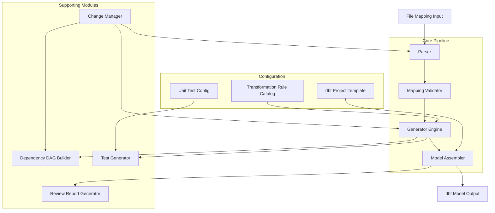

# Tài liệu Thiết kế — dbt Job Generator

## Tổng quan (Overview)

dbt Job Generator là một công cụ CLI tự động sinh dbt model (Spark SQL) từ file mapping đã được duyệt, phục vụ kiến trúc Data Lakehouse theo mô hình Medallion (Bronze → Silver → Gold). Công cụ đọc file mapping, xác minh tính hợp lệ, áp dụng các transformation rule, và sinh ra file `.sql` hoàn chỉnh cùng dependency DAG, schema test, và báo cáo review.

Mục tiêu thiết kế:
- Tự động hóa tối đa việc sinh code dbt model từ mapping đã duyệt
- Đảm bảo tính nhất quán thông qua Transformation Rule Catalog và dbt Project Template
- Hỗ trợ incremental change management khi mapping thay đổi
- Sinh báo cáo review để con người duyệt trước khi deploy

## Kiến trúc (Architecture)

Hệ thống được thiết kế theo kiến trúc pipeline, gồm các giai đoạn xử lý tuần tự:



Luồng xử lý chính:
1. **Parser** đọc và phân tích File_Mapping thành cấu trúc dữ liệu nội bộ (MappingSpec)
2. **Mapping Validator** xác minh tính hợp lệ về workflow (source tables tồn tại, dependency thỏa mãn)
3. **Generator Engine** áp dụng từng Mapping_Rule (DIRECT_MAP, CAST, HASH, HARDCODE, UNPIVOT, Filter, Business Logic) để sinh SQL fragments
4. **Model Assembler** tổng hợp Config Block + Source Reference + SQL fragments thành file .sql hoàn chỉnh
5. **Dependency DAG Builder** phân tích quan hệ phụ thuộc và sinh DAG
6. **Test Generator** sinh schema test và kiểm tra unit test bắt buộc
7. **Review Report Generator** sinh báo cáo tổng hợp cho con người review

## Thành phần và Giao diện (Components and Interfaces)

### 1. Parser

Chịu trách nhiệm đọc File_Mapping và chuyển đổi thành cấu trúc dữ liệu nội bộ.

```
Parser:
  parse(file_path: str) -> Result[MappingSpec, ParseError]
  parse_batch(directory: str) -> list[Result[MappingSpec, ParseError]]

PrettyPrinter:
  print(mapping: MappingSpec) -> str
```

- Hỗ trợ round-trip: `parse(pretty_print(parse(file))) == parse(file)`
- Trả về lỗi chi tiết với vị trí (dòng, cột) và loại lỗi khi file không hợp lệ

### 2. Mapping Validator

Xác minh tính hợp lệ của mapping về mặt workflow trước khi sinh code.

```
MappingValidator:
  validate(mapping: MappingSpec, context: ProjectContext) -> ValidationResult
  
ValidationResult:
  is_valid: bool
  missing_sources: list[MissingSource]
  missing_prerequisites: list[MissingPrerequisite]
  errors: list[ValidationError]
  warnings: list[ValidationWarning]

ProjectContext:
  existing_models: dict[str, ModelInfo]
  source_declarations: dict[str, SourceInfo]
  dependency_dag: DependencyDAG
```

- Kiểm tra source tables tồn tại ở layer trước (Bronze sources cho B→S, Silver models cho S→G)
- Kiểm tra prerequisite jobs đã tồn tại trong Dependency DAG
- Chạy trước khi Generator Engine bắt đầu sinh code

### 3. Generator Engine

Module trung tâm áp dụng các Mapping_Rule để sinh SQL fragments.

```
GeneratorEngine:
  generate_sql(mapping: MappingSpec, catalog: TransformationRuleCatalog) -> GenerationResult

GenerationResult:
  sql_fragments: list[SQLFragment]
  filter_clause: Optional[str]
  errors: list[GenerationError]
  warnings: list[str]
```

Các Rule Handler con:

```
DirectMapHandler:
  generate(field: FieldMapping) -> SQLFragment
  # Sinh: source_col AS target_col

CastHandler:
  generate(field: FieldMapping) -> SQLFragment
  # Sinh: CAST(source_col AS DECIMAL(p,s)) hoặc TO_DATE(source_col, format)

HashHandler:
  generate(field: FieldMapping, catalog: TransformationRuleCatalog) -> SQLFragment
  # Sinh: hash_function(business_key_cols) AS target_col

HardcodeHandler:
  generate(field: FieldMapping) -> SQLFragment
  # Sinh: '<value>' AS target_col hoặc <numeric> AS target_col

UnpivotHandler:
  generate(field: FieldMapping) -> list[SQLFragment]
  # Sinh: N khối SELECT nối bằng UNION ALL

BusinessLogicHandler:
  generate(field: FieldMapping, catalog: TransformationRuleCatalog) -> SQLFragment
  # Sinh: SQL expression từ catalog hoặc placeholder comment

FilterHandler:
  generate(mapping: MappingSpec) -> Optional[str]
  # Sinh: WHERE clause
```

### 4. Transformation Rule Catalog

Quản lý tập trung các transformation rule dùng chung.

```
TransformationRuleCatalog:
  get_hash_function() -> str
  get_rule(rule_name: str) -> Optional[TransformationRule]
  validate_reference(rule_name: str) -> bool
  list_rules() -> list[TransformationRule]

TransformationRule:
  name: str
  type: RuleType  # HASH | BUSINESS_LOGIC | DERIVED
  sql_template: str
  is_exception: bool
  description: str
```

### 5. Model Assembler

Tổng hợp các thành phần thành file dbt model hoàn chỉnh.

```
ModelAssembler:
  assemble(
    config: ConfigBlock,
    sources: list[SourceReference],
    sql_fragments: list[SQLFragment],
    filter_clause: Optional[str],
    template: ProjectTemplate
  ) -> str  # Complete .sql file content

ConfigBlockGenerator:
  generate(mapping: MappingSpec, template: ProjectTemplate) -> ConfigBlock

SourceReferenceGenerator:
  generate(mapping: MappingSpec, context: ProjectContext) -> list[SourceReference]
```

### 6. Dependency DAG Builder

Phân tích và sinh dependency graph.

```
DependencyDAGBuilder:
  build(mappings: list[MappingSpec]) -> Result[DependencyDAG, DAGError]
  detect_cycles(dag: DependencyDAG) -> list[list[str]]
  topological_sort(dag: DependencyDAG) -> list[str]

DependencyDAG:
  nodes: dict[str, DAGNode]
  edges: list[DAGEdge]
  
DAGNode:
  model_name: str
  layer: Layer  # BRONZE_TO_SILVER | SILVER_TO_GOLD
  source_tables: list[str]
```

### 7. Test Generator

Sinh schema test và kiểm tra unit test bắt buộc.

```
TestGenerator:
  generate_schema_tests(mapping: MappingSpec) -> SchemaTestConfig
  check_required_tests(model: dbt_Model, config: UnitTestConfig) -> TestComplianceReport

SchemaTestConfig:
  not_null_tests: list[str]
  unique_tests: list[str]
  relationship_tests: list[RelationshipTest]

UnitTestConfig:
  required_tests_by_layer: dict[Layer, list[TestRequirement]]
```

### 8. Change Manager

Xử lý incremental change khi mapping thay đổi.

```
ChangeManager:
  process_change(request: MappingChangeRequest, context: ProjectContext) -> ChangeResult
  diff(old_mapping: MappingSpec, new_mapping: MappingSpec) -> MappingDiff
  detect_downstream_impact(change: MappingDiff, dag: DependencyDAG) -> list[str]

MappingChangeRequest:
  type: ChangeType  # UPDATE_RULE | ADD_FIELD | NEW_MAPPING
  mapping_name: str
  changes: dict

ChangeResult:
  affected_models: list[str]
  diff_report: str
  downstream_warnings: list[str]

VersionStore:
  save_version(mapping_name: str, mapping: MappingSpec) -> str  # version_id
  get_version(mapping_name: str, version_id: str) -> MappingSpec
  list_versions(mapping_name: str) -> list[VersionInfo]
```

### 9. Review Report Generator

Sinh báo cáo review cho con người.

```
ReviewReportGenerator:
  generate(
    models: list[GeneratedModel],
    dag: DependencyDAG,
    test_compliance: list[TestComplianceReport],
    batch_result: BatchResult
  ) -> ReviewReport

ReviewReport:
  summary: BatchSummary
  model_details: list[ModelReviewDetail]
  execution_order: list[str]
  attention_items: list[AttentionItem]

ModelReviewDetail:
  model_name: str
  patterns_used: list[str]
  has_complex_logic: bool
  has_exceptions: bool
  test_compliance_status: str
```

### 10. Batch Processor

Điều phối xử lý nhiều file mapping cùng lúc.

```
BatchProcessor:
  process(directory: str, context: ProjectContext) -> BatchResult

BatchResult:
  successful: list[GeneratedModel]
  failed: list[FailedMapping]
  summary: BatchSummary

BatchSummary:
  total: int
  success_count: int
  error_count: int
  errors: list[ErrorDetail]
```


## Mô hình Dữ liệu (Data Models)

### MappingSpec — Cấu trúc dữ liệu nội bộ của File Mapping

```
MappingSpec:
  name: str                          # Tên mapping (tương ứng tên dbt model)
  layer: Layer                       # BRONZE_TO_SILVER | SILVER_TO_GOLD
  source_tables: list[SourceTable]   # Danh sách bảng nguồn
  target_table: str                  # Tên bảng đích
  target_schema: str                 # Schema đích
  fields: list[FieldMapping]        # Danh sách ánh xạ trường
  filter_condition: Optional[str]    # Điều kiện lọc (WHERE clause)
  metadata: MappingMetadata          # Metadata bổ sung

Layer:
  BRONZE_TO_SILVER
  SILVER_TO_GOLD

SourceTable:
  name: str
  alias: Optional[str]
  is_external: bool                  # True nếu raw data (dùng source()), False nếu dbt model (dùng ref())

FieldMapping:
  source_column: str
  target_column: str
  data_type: str
  mapping_rule: MappingRule
  is_not_null: bool
  is_unique_key: bool
  relationship: Optional[Relationship]

MappingRule:
  pattern: RulePattern               # DIRECT_MAP | CAST | HASH | HARDCODE | UNPIVOT | FILTER | BUSINESS_LOGIC
  params: dict                       # Tham số tùy theo pattern

RulePattern:
  DIRECT_MAP
  CAST
  HASH
  HARDCODE
  UNPIVOT
  FILTER
  BUSINESS_LOGIC

Relationship:
  target_table: str
  target_column: str
```

### Tham số theo từng RulePattern

```
DIRECT_MAP params: {}
  # Không cần tham số bổ sung

CAST params:
  cast_type: str                     # "CURRENCY_AMOUNT" | "DATE" | ...
  precision: Optional[int]           # Cho DECIMAL
  scale: Optional[int]               # Cho DECIMAL
  format: Optional[str]              # Cho DATE (e.g., "yyyy-MM-dd")

HASH params:
  business_key_columns: list[str]    # Danh sách cột business key
  catalog_rule_name: str             # Tên rule trong Transformation Rule Catalog

HARDCODE params:
  value: str | int | float           # Giá trị hardcode
  value_type: str                    # "STRING" | "NUMERIC"

UNPIVOT params:
  source_columns: list[UnpivotColumn]
  
UnpivotColumn:
  column_name: str
  type_code: str                     # Type Code tương ứng

BUSINESS_LOGIC params:
  catalog_rule_name: str             # Tên rule trong catalog
  is_exception: bool                 # True nếu cần code thủ công
  sql_expression: Optional[str]      # SQL expression (nếu inline)
```

### ConfigBlock

```
ConfigBlock:
  materialization: str               # "table" | "view" | "incremental"
  schema: str                        # Schema theo layer
  tags: list[str]                    # Tags cho model
  custom_config: dict                # Config bổ sung từ template
```

### SourceReference

```
SourceReference:
  type: RefType                      # SOURCE | REF
  source_name: Optional[str]         # Tên source (cho macro source())
  table_name: str                    # Tên bảng
  alias: Optional[str]               # Alias trong SQL

RefType:
  SOURCE                             # Dùng macro source()
  REF                                # Dùng macro ref()
```

### SQLFragment

```
SQLFragment:
  column_expression: str             # Biểu thức SQL cho cột
  target_alias: str                  # Alias đích
  fragment_type: FragmentType        # Loại fragment
  
FragmentType:
  SELECT_COLUMN                      # Cột đơn trong SELECT
  UNION_BLOCK                        # Khối UNION ALL (cho UNPIVOT)
```

### DependencyDAG

```
DependencyDAG:
  nodes: dict[str, DAGNode]
  edges: list[DAGEdge]

DAGNode:
  model_name: str
  layer: Layer
  source_tables: list[str]

DAGEdge:
  from_model: str                    # Model phụ thuộc
  to_model: str                      # Model được phụ thuộc
```

### MappingDiff — Cho Change Management

```
MappingDiff:
  mapping_name: str
  added_fields: list[FieldMapping]
  removed_fields: list[FieldMapping]
  modified_fields: list[FieldModification]
  filter_changed: bool
  old_filter: Optional[str]
  new_filter: Optional[str]

FieldModification:
  field_name: str
  old_rule: MappingRule
  new_rule: MappingRule
  old_data_type: str
  new_data_type: str
```

### MappingVersion — Cho Version History

```
MappingVersion:
  version_id: str
  mapping_name: str
  timestamp: datetime
  mapping_spec: MappingSpec
  change_description: str
```


## Thuộc tính Đúng đắn (Correctness Properties)

*Một thuộc tính (property) là một đặc điểm hoặc hành vi phải luôn đúng trong mọi lần thực thi hợp lệ của hệ thống — về bản chất là một phát biểu hình thức về những gì hệ thống phải làm. Các property đóng vai trò cầu nối giữa đặc tả dễ đọc cho con người và đảm bảo tính đúng đắn có thể kiểm chứng bằng máy.*

### Property 1: Parser round-trip

*For any* MappingSpec hợp lệ, việc pretty-print rồi parse lại SHALL tạo ra đối tượng MappingSpec tương đương với đối tượng ban đầu. Tức là: `parse(pretty_print(spec)) == spec`.

**Validates: Requirements 1.1, 1.2, 1.4**

### Property 2: Parser báo lỗi chính xác cho input không hợp lệ

*For any* chuỗi input không tuân thủ định dạng File_Mapping (thiếu trường bắt buộc, sai cú pháp), Parser SHALL trả về lỗi chứa thông tin vị trí (dòng/cột) và mô tả loại lỗi, và SHALL KHÔNG trả về MappingSpec hợp lệ.

**Validates: Requirements 1.3**

### Property 3: Validator phát hiện đúng source tables thiếu theo layer

*For any* MappingSpec và ProjectContext, tập hợp source tables mà Validator báo thiếu SHALL bằng đúng tập hợp source tables trong mapping mà không tồn tại trong context ở layer tương ứng (Bronze sources cho B→S, Silver models/sources cho S→G).

**Validates: Requirements 2.1, 2.2, 2.3**

### Property 4: Validator phát hiện đúng prerequisite jobs thiếu

*For any* MappingSpec tầng Silver → Gold và DependencyDAG hiện tại, tập hợp prerequisite jobs mà Validator báo thiếu SHALL bằng đúng tập hợp Bronze → Silver jobs được tham chiếu bởi mapping mà chưa tồn tại trong DAG.

**Validates: Requirements 2.4, 2.5**

### Property 5: DIRECT_MAP sinh đúng SELECT alias

*For any* FieldMapping có pattern DIRECT_MAP với source_column `s` và target_column `t`, Generator SHALL sinh SQL fragment chứa `s AS t`.

**Validates: Requirements 3.1, 3.2**

### Property 6: CAST sinh đúng biểu thức chuyển đổi kiểu

*For any* FieldMapping có pattern CAST, Generator SHALL sinh SQL fragment tương ứng: `CAST(source AS DECIMAL(p,s))` cho Currency Amount (với precision `p` và scale `s` từ mapping), hoặc `TO_DATE(source, '<format>')` cho Date (với format từ mapping).

**Validates: Requirements 4.1, 4.2**

### Property 7: CAST báo lỗi khi thiếu tham số

*For any* FieldMapping có pattern CAST mà thiếu precision/scale (cho Currency Amount) hoặc thiếu format (cho Date), Generator SHALL trả về lỗi chỉ rõ tên trường và tham số bị thiếu, và SHALL KHÔNG sinh SQL fragment.

**Validates: Requirements 4.3**

### Property 8: HASH sinh đúng hàm hash từ catalog và đảm bảo nhất quán

*For any* tập hợp FieldMappings có pattern HASH trong toàn bộ project, Generator SHALL sinh SQL sử dụng cùng một hàm hash chuẩn từ Transformation_Rule_Catalog, với danh sách business key columns lấy đúng từ mỗi FieldMapping tương ứng.

**Validates: Requirements 5.1, 5.2**

### Property 9: Business Logic sinh đúng SQL hoặc placeholder từ catalog

*For any* FieldMapping có pattern Business Logic, nếu rule KHÔNG phải exception thì Generator SHALL sinh SQL expression đúng như được định nghĩa trong Transformation_Rule_Catalog; nếu rule LÀ exception thì Generator SHALL sinh placeholder comment chỉ rõ vị trí cần bổ sung logic thủ công.

**Validates: Requirements 5.3, 5.4**

### Property 10: Generator báo lỗi khi tham chiếu rule không tồn tại trong catalog

*For any* FieldMapping tham chiếu đến rule_name không tồn tại trong Transformation_Rule_Catalog, Generator SHALL trả về lỗi chỉ rõ tên rule bị thiếu và tên File_Mapping liên quan.

**Validates: Requirements 5.6**

### Property 11: HARDCODE sinh đúng giá trị theo kiểu dữ liệu

*For any* FieldMapping có pattern HARDCODE, nếu value_type là STRING thì Generator SHALL sinh `'<value>' AS target_col` (có quotes), nếu value_type là NUMERIC thì Generator SHALL sinh `<value> AS target_col` (không có quotes).

**Validates: Requirements 6.1, 6.2**

### Property 12: UNPIVOT sinh đúng số khối UNION ALL

*For any* FieldMapping có pattern UNPIVOT với N source columns, Generator SHALL sinh đúng N khối SELECT được nối bằng UNION ALL, mỗi khối chứa source column và Type Code tương ứng từ mapping.

**Validates: Requirements 7.1, 7.2**

### Property 13: Filter condition sinh đúng WHERE clause (bidirectional)

*For any* MappingSpec, dbt_Model output SHALL chứa WHERE clause khi và chỉ khi mapping có filter_condition. Khi có, WHERE clause SHALL chứa đúng biểu thức filter từ mapping.

**Validates: Requirements 8.1, 8.2**

### Property 14: Config Block schema tương ứng với layer

*For any* MappingSpec, Config_Block trong dbt_Model output SHALL chứa materialization, tags, và schema theo dbt_Project_Template, trong đó schema SHALL tương ứng với tầng Silver nếu layer là BRONZE_TO_SILVER, và tầng Gold nếu layer là SILVER_TO_GOLD.

**Validates: Requirements 9.1, 9.2, 9.3**

### Property 15: Source Reference macro tương ứng với loại source

*For any* SourceTable trong MappingSpec, Source_Reference SHALL sử dụng macro `source()` nếu source table là external (is_external = true), và macro `ref()` nếu source table là internal dbt model (is_external = false).

**Validates: Requirements 10.1, 10.2**

### Property 16: Dependency DAG phản ánh đúng quan hệ phụ thuộc

*For any* tập hợp MappingSpecs, Dependency_DAG SHALL chứa edge (A → B) khi và chỉ khi model A có source table tương ứng với model B. Mọi source table dependency của mỗi model đều phải được thể hiện trong DAG.

**Validates: Requirements 11.1, 11.4**

### Property 17: Phát hiện circular dependency trong DAG

*For any* tập hợp MappingSpecs tạo ra circular dependency, Generator SHALL phát hiện cycle và báo lỗi liệt kê đúng danh sách models tham gia vào vòng lặp. *For any* tập hợp MappingSpecs KHÔNG có circular dependency, DAG Builder SHALL sinh DAG hợp lệ không có cycle.

**Validates: Requirements 11.2, 11.3**

### Property 18: Model assembly đúng thứ tự và đầy đủ thành phần

*For any* MappingSpec chứa hỗn hợp các Mapping_Rule types, dbt_Model output SHALL là file .sql chứa Config_Block → Source_Reference → SQL transform theo đúng thứ tự, và SHALL chứa SQL fragments cho TẤT CẢ các rules trong mapping.

**Validates: Requirements 12.1, 12.2**

### Property 19: Batch processing đảm bảo tính nhất quán kết quả

*For any* batch gồm N File_Mappings (trong đó V valid và I invalid, V + I = N), BatchResult SHALL có success_count = V, error_count = I, và tổng success_count + error_count = N. Mọi valid mapping đều được sinh model, mọi invalid mapping đều có error detail.

**Validates: Requirements 13.1, 13.2, 13.3**

### Property 20: Diff detection chính xác khi mapping thay đổi

*For any* cặp (old MappingSpec, new MappingSpec), MappingDiff SHALL chứa đúng danh sách fields được thêm, xóa, và sửa đổi. Tức là: áp dụng diff lên old mapping phải tạo ra new mapping.

**Validates: Requirements 14.1, 14.4**

### Property 21: Thêm trường mới không ảnh hưởng trường hiện có

*For any* MappingSpec và tập hợp fields mới được thêm, SQL output cho các fields hiện có trong dbt_Model mới SHALL giữ nguyên so với dbt_Model cũ.

**Validates: Requirements 14.2**

### Property 22: Downstream impact detection

*For any* MappingChangeRequest và DependencyDAG, tập hợp downstream models được cảnh báo SHALL bằng đúng tập hợp models có dependency (trực tiếp hoặc gián tiếp) vào model bị thay đổi trong DAG.

**Validates: Requirements 14.5**

### Property 23: Version store round-trip

*For any* MappingSpec, sau khi lưu vào VersionStore và truy xuất lại bằng version_id, MappingSpec trả về SHALL tương đương với MappingSpec ban đầu.

**Validates: Requirements 14.6**

### Property 24: Test generation phản ánh đúng field constraints

*For any* MappingSpec, SchemaTestConfig output SHALL chứa not_null test cho mọi field có is_not_null = true, unique test cho mọi field có is_unique_key = true, và relationship test cho mọi field có relationship != null. Không có test thừa cho fields không có constraint tương ứng.

**Validates: Requirements 15.1, 15.2, 15.3**

### Property 25: Phát hiện đúng unit tests bắt buộc còn thiếu

*For any* dbt_Model và UnitTestConfig, danh sách missing tests SHALL bằng đúng tập hợp required tests trong config mà chưa có trong model. Model SHALL được đánh dấu "chưa đạt tiêu chuẩn" khi và chỉ khi danh sách missing tests không rỗng.

**Validates: Requirements 15.5, 15.6**

### Property 26: Review report đầy đủ và đánh dấu đúng

*For any* batch GeneratedModels, ReviewReport SHALL chứa entry cho mọi model trong batch, liệt kê đúng patterns được sử dụng, và SHALL đánh dấu model là "cần review kỹ" khi và chỉ khi model chứa Business Logic exception hoặc logic phức tạp.

**Validates: Requirements 16.1, 16.2**

### Property 27: Thứ tự thực thi là topological sort hợp lệ

*For any* DependencyDAG, execution order trong ReviewReport SHALL là một topological sort hợp lệ của DAG — tức là mọi model xuất hiện SAU tất cả các models mà nó phụ thuộc.

**Validates: Requirements 16.3**


## Xử lý Lỗi (Error Handling)

### Phân loại lỗi

Hệ thống phân loại lỗi thành các nhóm sau:

| Loại lỗi | Module | Mô tả | Hành vi |
|-----------|--------|--------|---------|
| `ParseError` | Parser | File mapping sai định dạng, thiếu trường bắt buộc | Trả về lỗi với vị trí (dòng/cột) và loại lỗi. Dừng xử lý file đó. |
| `ValidationError` | Mapping Validator | Source table thiếu, prerequisite job chưa tồn tại | Trả về danh sách lỗi chi tiết. Không sinh model cho mapping lỗi. |
| `CatalogError` | Generator Engine | Rule tham chiếu không tồn tại trong catalog | Trả về lỗi chỉ rõ tên rule và mapping liên quan. |
| `GenerationError` | Generator Engine | Thiếu tham số (CAST thiếu precision/format) | Trả về lỗi chỉ rõ trường và tham số thiếu. |
| `DAGError` | DAG Builder | Circular dependency | Trả về danh sách models trong cycle. |
| `ChangeError` | Change Manager | Conflict khi áp dụng change | Trả về mô tả conflict và gợi ý giải quyết. |

### Chiến lược xử lý lỗi

1. **Fail-fast cho single file**: Khi xử lý một file mapping đơn lẻ, lỗi ở bất kỳ giai đoạn nào (parse, validate, generate) sẽ dừng pipeline và trả về lỗi chi tiết.

2. **Fail-safe cho batch**: Khi xử lý batch, lỗi ở một file KHÔNG dừng toàn bộ batch. File lỗi được ghi nhận, các file còn lại tiếp tục xử lý. Báo cáo tổng hợp cuối cùng liệt kê tất cả lỗi.

3. **Validation trước Generation**: Mapping Validator chạy trước Generator Engine. Chỉ các mapping hợp lệ về workflow mới được chuyển sang giai đoạn sinh code.

4. **Error aggregation**: Trong mỗi giai đoạn, hệ thống thu thập TẤT CẢ lỗi có thể phát hiện (không dừng ở lỗi đầu tiên) để người dùng có thể sửa nhiều lỗi cùng lúc.

5. **Warning vs Error**: Lỗi nghiêm trọng (ParseError, CatalogError) ngăn sinh model. Cảnh báo (missing prerequisite, downstream impact) được ghi nhận nhưng không ngăn sinh model.

### Error Response Format

```
ErrorResponse:
  error_type: str          # Loại lỗi (ParseError, ValidationError, ...)
  message: str             # Mô tả lỗi dễ đọc
  location: Optional[ErrorLocation]  # Vị trí lỗi trong file
  context: dict            # Thông tin bổ sung (tên mapping, tên rule, ...)
  severity: Severity       # ERROR | WARNING

ErrorLocation:
  file: str
  line: Optional[int]
  column: Optional[int]
  field_name: Optional[str]
```

## Chiến lược Kiểm thử (Testing Strategy)

### Phương pháp kiểm thử kép

Hệ thống sử dụng kết hợp hai phương pháp kiểm thử:

1. **Property-based tests (PBT)**: Kiểm chứng các thuộc tính phổ quát trên nhiều input ngẫu nhiên — đảm bảo tính đúng đắn tổng quát.
2. **Unit tests (example-based)**: Kiểm chứng các trường hợp cụ thể, edge cases, và integration points — đảm bảo hành vi đúng cho các scenario quan trọng.

### Property-Based Testing

**Thư viện**: Sử dụng [Hypothesis](https://hypothesis.readthedocs.io/) (Python) cho property-based testing.

**Cấu hình**:
- Mỗi property test chạy tối thiểu 100 iterations
- Mỗi test được tag theo format: `Feature: dbt-job-generator, Property {number}: {property_text}`

**Generators cần xây dựng**:
- `MappingSpec` generator: Sinh random valid MappingSpec với các rule types khác nhau
- `FieldMapping` generator: Sinh random fields với các pattern (DIRECT_MAP, CAST, HASH, HARDCODE, UNPIVOT, BUSINESS_LOGIC)
- `ProjectContext` generator: Sinh random project context với existing models và source declarations
- `DependencyDAG` generator: Sinh random DAG (có và không có cycles)
- `MappingChangeRequest` generator: Sinh random change requests
- `UnitTestConfig` generator: Sinh random test configurations
- `TransformationRuleCatalog` generator: Sinh random catalog với rules

**Danh sách Property Tests** (tham chiếu mục Correctness Properties):

| Property | Module được test | Mô tả ngắn |
|----------|-----------------|-------------|
| Property 1 | Parser + PrettyPrinter | Round-trip: parse → print → parse = identity |
| Property 2 | Parser | Invalid input → error with location |
| Property 3 | Mapping Validator | Missing source detection across layers |
| Property 4 | Mapping Validator | Missing prerequisite detection |
| Property 5 | DirectMapHandler | DIRECT_MAP → `s AS t` |
| Property 6 | CastHandler | CAST → correct type conversion expression |
| Property 7 | CastHandler | Missing CAST params → error |
| Property 8 | HashHandler | HASH → consistent hash function from catalog |
| Property 9 | BusinessLogicHandler | BL → catalog expression or placeholder |
| Property 10 | Generator Engine | Missing catalog rule → error |
| Property 11 | HardcodeHandler | HARDCODE → type-aware formatting |
| Property 12 | UnpivotHandler | UNPIVOT N cols → N UNION ALL blocks |
| Property 13 | FilterHandler | Filter ↔ WHERE clause (bidirectional) |
| Property 14 | ConfigBlockGenerator | Config schema matches layer |
| Property 15 | SourceReferenceGenerator | Macro type matches source type |
| Property 16 | DAG Builder | DAG edges match source dependencies |
| Property 17 | DAG Builder | Cycle detection accuracy |
| Property 18 | Model Assembler | Assembly order and completeness |
| Property 19 | Batch Processor | Batch result count consistency |
| Property 20 | Change Manager | Diff detection accuracy |
| Property 21 | Change Manager | Add field preserves existing fields |
| Property 22 | Change Manager | Downstream impact detection |
| Property 23 | Version Store | Version save/load round-trip |
| Property 24 | Test Generator | Test generation matches constraints |
| Property 25 | Test Generator | Missing test detection |
| Property 26 | Review Report Generator | Report completeness and flagging |
| Property 27 | Review Report Generator | Execution order is valid topological sort |

### Unit Tests (Example-Based)

Unit tests bổ sung cho PBT, tập trung vào:

1. **Specific examples**: Các mapping cụ thể đại diện cho từng pattern (DIRECT_MAP, CAST, HASH, HARDCODE, UNPIVOT)
2. **Edge cases**:
   - File mapping rỗng (không có fields)
   - Mapping chỉ có một field
   - UNPIVOT với 1 source column (edge case cho UNION ALL)
   - HARDCODE với giá trị rỗng hoặc chứa ký tự đặc biệt (quotes, backslash)
   - DAG với một node duy nhất (không có dependency)
   - Batch với tất cả files lỗi
   - Batch với tất cả files thành công
3. **Integration tests**:
   - Pipeline end-to-end: file mapping → dbt model output
   - Batch processing với thư mục thực tế
   - Change management workflow hoàn chỉnh
4. **Smoke tests**:
   - Đọc Unit_Test_Config file (Req 15.4)
   - Cập nhật Unit_Test_Config (Req 15.7)
   - Validation chạy trước generation trong pipeline (Req 2.6)
   - Rule catalog uniqueness constraint (Req 5.5)

