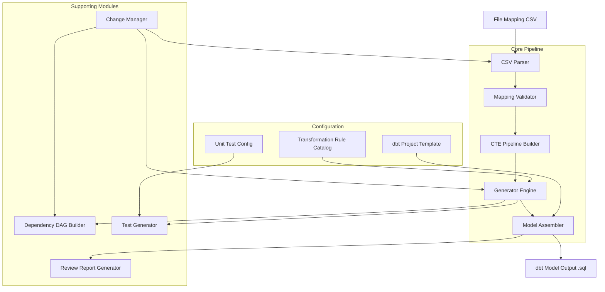

# Tài liệu Thiết kế — dbt Job Generator

## Tổng quan (Overview)

dbt Job Generator là một công cụ CLI tự động sinh dbt model (Spark SQL) từ file mapping CSV đã được duyệt, phục vụ kiến trúc Data Lakehouse theo mô hình Medallion (Bronze → Silver → Gold). Công cụ đọc file mapping CSV, xác minh tính hợp lệ, xây dựng pipeline CTE từ các source entries, áp dụng các transformation rule, và sinh ra file `.sql` hoàn chỉnh cùng dependency DAG, schema test, và báo cáo review.

Mục tiêu thiết kế:
- Tự động hóa tối đa việc sinh code dbt model từ mapping đã duyệt
- Hỗ trợ đầy đủ các source type: `physical_table`, `unpivot_cte`, `derived_cte`
- Sinh SQL sử dụng cú pháp Spark SQL với `:: data_type` cho type casting
- Sinh WITH clause (CTE pipeline) và UNION ALL cho unpivot pattern
- Đảm bảo tính nhất quán thông qua Transformation Rule Catalog và dbt Project Template
- Hỗ trợ incremental change management khi mapping thay đổi
- Sinh báo cáo review để con người duyệt trước khi deploy

## Kiến trúc (Architecture)

Hệ thống được thiết kế theo kiến trúc pipeline, gồm các giai đoạn xử lý tuần tự:



Luồng xử lý chính:
1. **CSV Parser** đọc và phân tích File_Mapping CSV thành cấu trúc dữ liệu nội bộ (MappingSpec) gồm 4 section: Target, Input, Relationship, Mapping, Final Filter
2. **Mapping Validator** xác minh tính hợp lệ về workflow (source tables tồn tại, CTE pipeline hợp lệ, dependency thỏa mãn)
3. **CTE Pipeline Builder** xây dựng chuỗi CTE từ Input section — xử lý `physical_table`, `unpivot_cte`, `derived_cte` theo thứ tự dependency
4. **Generator Engine** áp dụng từng Mapping_Rule để sinh SQL fragments, bao gồm type casting với `::`, hash_id(), hardcode, NULL handling
5. **Model Assembler** tổng hợp Config Block + WITH clause (CTEs) + Main SELECT + JOINs + Final Filter thành file .sql hoàn chỉnh
6. **Dependency DAG Builder** phân tích quan hệ phụ thuộc và sinh DAG
7. **Test Generator** sinh schema test và kiểm tra unit test bắt buộc
8. **Review Report Generator** sinh báo cáo tổng hợp cho con người review

### Cấu trúc SQL Output

Dựa trên phân tích các mapping mẫu thực tế, SQL output có cấu trúc:

```sql
-- Config Block
{{ config(materialized='table', schema='silver', tags=['etl_handle']) }}

-- WITH clause (CTE Pipeline)
WITH cte_alias_1 AS (
    SELECT field1, field2, ...
    FROM schema.table_name
    WHERE filter_condition
),
cte_alias_2 AS (
    -- unpivot_cte: multiple UNION ALL blocks
    SELECT id AS key_col, 'TYPE1' AS type_code, col1 AS value_col, passthrough_col
    FROM cte_alias_1
    WHERE col1 IS NOT NULL
    UNION ALL
    SELECT id AS key_col, 'TYPE2' AS type_code, col2 AS value_col, passthrough_col
    FROM cte_alias_1
    WHERE col2 IS NOT NULL
    ...
),
cte_alias_3 AS (
    -- derived_cte: aggregation/transformation
    SELECT key_col, array_agg(value_col) AS agg_col
    FROM cte_alias_1
    GROUP BY key_col
)

-- Main SELECT with type casting
SELECT
    hash_id(col1, col2) AS hash_key,
    alias.col1 :: string AS target_col1,
    alias.col2 :: bigint AS target_col2,
    'hardcoded_value' :: string AS target_col3,
    NULL :: timestamp AS unmapped_col
FROM cte_alias_1 AS alias
LEFT JOIN cte_alias_3 AS join_alias ON alias.id = join_alias.key_col

-- Final Filter (UNION ALL hoặc WHERE)
UNION ALL
SELECT ... FROM another_cte
```

## Thành phần và Giao diện (Components and Interfaces)

### 1. CSV Parser

Chịu trách nhiệm đọc File_Mapping CSV và chuyển đổi thành cấu trúc dữ liệu nội bộ. File CSV có 5 section chính: Target, Input, Relationship, Mapping, Final Filter.

```
CSVParser:
  parse(file_path: str) -> Result[MappingSpec, ParseError]
  parse_batch(directory: str) -> list[Result[MappingSpec, ParseError]]

PrettyPrinter:
  print(mapping: MappingSpec) -> str
```

**Các section trong CSV:**

| Section | Mô tả | Các cột |
|---------|--------|---------|
| Target | Thông tin bảng đích | Database, Schema, Table Name, ETL Handle, Description |
| Input | Danh sách source entries (CTE pipeline) | #, Source Type, Schema, Table Name, Alias, Select Fields, Filter |
| Relationship | Quan hệ JOIN giữa các CTE | Main Alias, Join Type, Join Alias, Join Condition |
| Mapping | Ánh xạ từ source → target columns | #, Target Column, Transformation, Data Type, Description |
| Final Filter | Điều kiện lọc cuối hoặc UNION ALL | Free-form expression |

- Hỗ trợ round-trip: `parse(pretty_print(parse(file))) == parse(file)`
- Trả về lỗi chi tiết với vị trí (dòng, cột) và loại lỗi khi file không hợp lệ

### 2. Mapping Validator

Xác minh tính hợp lệ của mapping về mặt workflow trước khi sinh code. Kết quả validation được phân loại thành hai mức nghiêm trọng: **WARNING** (ghi nhận, không ngăn generate) và **BLOCK** (ngăn generate, bắt buộc phải sửa).

```
MappingValidator:
  validate(mapping: MappingSpec, context: ProjectContext, schema_dir: Optional[str] = None) -> ValidationResult
  validate_cte_pipeline(inputs: list[SourceEntry]) -> list[CTEValidationError]
  validate_schema(mapping: MappingSpec, schema_dir: str) -> list[SchemaValidationError]
  validate_batch(directory: str, context: ProjectContext, schema_dir: Optional[str] = None) -> BatchValidationResult

ValidationResult:
  is_valid: bool                    # True nếu không có lỗi BLOCK
  has_warnings: bool                # True nếu có bất kỳ warning nào
  block_errors: list[BlockError]    # Lỗi ngăn generate
  warnings: list[ValidationWarning] # Cảnh báo không ngăn generate

BlockError:
  error_type: str                   # "PARSE_ERROR" | "CTE_DEPENDENCY" | "SCHEMA_COLUMN_NOT_FOUND" | "SCHEMA_DATA_TYPE_MISMATCH"
  message: str
  location: Optional[ErrorLocation]
  context: dict

ValidationWarning:
  warning_type: str                 # "MISSING_SOURCE" | "MISSING_PREREQUISITE" | "MISSING_SCHEMA_FILE"
  message: str
  context: dict

BatchValidationResult:
  total: int
  valid_count: int                  # Không có lỗi BLOCK
  warning_count: int                # Có warnings nhưng không có BLOCK
  blocked_count: int                # Có lỗi BLOCK
  results: dict[str, ValidationResult]  # Kết quả theo từng file

ProjectContext:
  existing_models: dict[str, ModelInfo]
  source_declarations: dict[str, SourceInfo]
  dependency_dag: DependencyDAG
```

**Phân loại mức độ nghiêm trọng:**

| Mức | Loại lỗi | Hành vi |
|-----|----------|---------|
| **WARNING** | Missing source tables | Ghi nhận, KHÔNG ngăn generate |
| **WARNING** | Missing prerequisite jobs | Ghi nhận, KHÔNG ngăn generate |
| **WARNING** | Missing Target_Schema_File | Ghi nhận, KHÔNG ngăn generate |
| **BLOCK** | Parse errors (CSV format lỗi, thiếu section) | Ngăn generate |
| **BLOCK** | CTE pipeline dependency errors | Ngăn generate |
| **BLOCK** | Schema validation errors (column name mismatch, data type mismatch) | Ngăn generate |

- Kiểm tra source tables tồn tại ở layer trước (Bronze sources cho B→S, Silver models cho S→G) → WARNING nếu thiếu
- Kiểm tra CTE pipeline hợp lệ: `unpivot_cte` và `derived_cte` phải tham chiếu đến alias đã khai báo trước đó → BLOCK nếu lỗi
- Kiểm tra prerequisite jobs đã tồn tại trong Dependency DAG → WARNING nếu thiếu
- Kiểm tra schema bảng đích (nếu có Target_Schema_File) → BLOCK nếu column name hoặc data type không khớp
- Hỗ trợ batch validation: xác minh toàn bộ thư mục và sinh báo cáo tổng hợp
- Chạy trước khi Generator Engine bắt đầu sinh code; chỉ mapping không có lỗi BLOCK mới được xử lý tiếp

### 2a. Schema Validator (thuộc Mapping Validator)

Module con của Mapping Validator, chịu trách nhiệm kiểm tra mapping có phù hợp với schema bảng đích hay không. Schema files được lưu trữ theo từng bảng, do Database Designer maintain.

```
SchemaValidator:
  validate(mapping: MappingSpec, schema_dir: str) -> list[SchemaValidationError]
  load_schema(schema_dir: str, schema: str, table_name: str) -> Optional[TargetSchemaFile]

TargetSchemaFile:
  table_name: str
  columns: list[SchemaColumn]

SchemaColumn:
  name: str
  data_type: str
  nullable: bool
  description: Optional[str]

SchemaValidationError:
  error_type: "COLUMN_NOT_FOUND" | "DATA_TYPE_MISMATCH"
  column_name: str
  expected: str              # Từ schema file
  actual: str                # Từ mapping
  message: str
```

**Quy ước đường dẫn schema file:** `schemas/{schema}/{table_name}.json`

**Định dạng file:** JSON hoặc YAML, ví dụ:
```json
{
  "table_name": "fund_management_company",
  "columns": [
    {"name": "hash_key", "data_type": "string", "nullable": false, "description": "Surrogate key"},
    {"name": "fund_id", "data_type": "bigint", "nullable": false, "description": "Fund ID"}
  ]
}
```

**Hành vi:**
- Nếu Target_Schema_File tồn tại: kiểm tra tên cột và data type → lỗi BLOCK nếu không khớp
- Nếu Target_Schema_File không tồn tại: ghi nhận WARNING, không ngăn generate
- Lỗi COLUMN_NOT_FOUND: cột trong mapping không có trong schema file
- Lỗi DATA_TYPE_MISMATCH: data type trong mapping không tương thích với schema file

### 3. CTE Pipeline Builder

Module mới — xây dựng chuỗi CTE (WITH clause) từ Input section của mapping.

```
CTEPipelineBuilder:
  build(inputs: list[SourceEntry]) -> list[CTEDefinition]

CTEDefinition:
  alias: str
  sql: str                           # SQL body của CTE
  source_type: SourceType
  depends_on: list[str]              # Aliases mà CTE này phụ thuộc

PhysicalTableCTEBuilder:
  build(entry: SourceEntry) -> CTEDefinition
  # Sinh: SELECT select_fields FROM schema.table_name WHERE filter

UnpivotCTEBuilder:
  build(entry: SourceEntry) -> CTEDefinition
  # Sinh: N khối SELECT ... UNION ALL từ unpivot field spec
  # Mỗi khối: SELECT key=source | 'TYPE' AS type_code | col AS value | passthrough
  #            FROM source_alias WHERE col IS NOT NULL

DerivedCTEBuilder:
  build(entry: SourceEntry) -> CTEDefinition
  # Sinh: SELECT select_fields FROM source_alias [GROUP BY / aggregation]
```

### 4. Generator Engine

Module trung tâm áp dụng các Mapping_Rule để sinh SQL fragments cho Main SELECT.

```
GeneratorEngine:
  generate_sql(mapping: MappingSpec, catalog: TransformationRuleCatalog) -> GenerationResult

GenerationResult:
  cte_definitions: list[CTEDefinition]   # WITH clause
  select_columns: list[SelectColumn]     # Main SELECT columns
  from_clause: str                       # FROM + JOINs
  final_filter: Optional[str]            # UNION ALL hoặc WHERE
  errors: list[GenerationError]
  warnings: list[str]

SelectColumn:
  expression: str                        # e.g., "alias.col :: string"
  target_alias: str                      # AS target_col
```

Các Rule Handler con:

```
DirectMapHandler:
  generate(entry: MappingEntry, source_alias: str) -> SelectColumn
  # Sinh: alias.source_col :: data_type AS target_col

TypeCastHandler:
  generate(entry: MappingEntry) -> SelectColumn
  # Sinh: expression :: data_type AS target_col
  # Sử dụng :: thay vì CAST() cho Spark SQL

HashHandler:
  generate(entry: MappingEntry, catalog: TransformationRuleCatalog) -> SelectColumn
  # Sinh: hash_id(col1, col2, ...) AS target_col

HardcodeHandler:
  generate(entry: MappingEntry) -> SelectColumn
  # Sinh: 'value' :: string AS target_col hoặc numeric :: type AS target_col

NullHandler:
  generate(entry: MappingEntry) -> SelectColumn
  # Sinh: NULL :: data_type AS target_col (cho unmapped fields)

BusinessLogicHandler:
  generate(entry: MappingEntry, catalog: TransformationRuleCatalog) -> SelectColumn
  # Sinh: SQL expression từ catalog hoặc placeholder comment
```

### 5. Transformation Rule Catalog

Quản lý tập trung các transformation rule dùng chung.

```
TransformationRuleCatalog:
  get_hash_function() -> str
  get_rule(rule_name: str) -> Optional[TransformationRule]
  validate_reference(rule_name: str) -> bool
  list_rules() -> list[TransformationRule]

TransformationRule:
  name: str
  type: RuleType  # HASH | BUSINESS_LOGIC | DERIVED
  sql_template: str
  is_exception: bool
  description: str
```

### 6. Model Assembler

Tổng hợp các thành phần thành file dbt model hoàn chỉnh.

```
ModelAssembler:
  assemble(
    config: ConfigBlock,
    cte_definitions: list[CTEDefinition],
    select_columns: list[SelectColumn],
    from_clause: str,
    final_filter: Optional[str],
    template: ProjectTemplate
  ) -> str  # Complete .sql file content

ConfigBlockGenerator:
  generate(mapping: MappingSpec, template: ProjectTemplate) -> ConfigBlock

FromClauseGenerator:
  generate(mapping: MappingSpec) -> str
  # Sinh: FROM main_alias [LEFT JOIN join_alias ON condition] ...
```

**Thứ tự assembly:**
1. Config Block (`{{ config(...) }}`)
2. WITH clause (tất cả CTEs)
3. Main SELECT (tất cả columns với `::` type casting)
4. FROM clause (main alias + JOINs từ Relationship section)
5. Final Filter (UNION ALL hoặc WHERE, nếu có)

### 7. Dependency DAG Builder

Phân tích và sinh dependency graph.

```
DependencyDAGBuilder:
  build(mappings: list[MappingSpec]) -> Result[DependencyDAG, DAGError]
  detect_cycles(dag: DependencyDAG) -> list[list[str]]
  topological_sort(dag: DependencyDAG) -> list[str]

DependencyDAG:
  nodes: dict[str, DAGNode]
  edges: list[DAGEdge]
  
DAGNode:
  model_name: str
  layer: Layer  # BRONZE_TO_SILVER | SILVER_TO_GOLD
  physical_sources: list[str]        # Chỉ physical_table entries
```

### 8. Test Generator

Sinh schema test và kiểm tra unit test bắt buộc.

```
TestGenerator:
  generate_schema_tests(mapping: MappingSpec) -> SchemaTestConfig
  check_required_tests(model: dbt_Model, config: UnitTestConfig) -> TestComplianceReport

SchemaTestConfig:
  not_null_tests: list[str]
  unique_tests: list[str]
  relationship_tests: list[RelationshipTest]

UnitTestConfig:
  required_tests_by_layer: dict[Layer, list[TestRequirement]]
```

### 9. Change Manager

Xử lý incremental change khi mapping thay đổi.

```
ChangeManager:
  process_change(request: MappingChangeRequest, context: ProjectContext) -> ChangeResult
  diff(old_mapping: MappingSpec, new_mapping: MappingSpec) -> MappingDiff
  detect_downstream_impact(change: MappingDiff, dag: DependencyDAG) -> list[str]

MappingChangeRequest:
  type: ChangeType  # UPDATE_RULE | ADD_FIELD | NEW_MAPPING
  mapping_name: str
  changes: dict

ChangeResult:
  affected_models: list[str]
  diff_report: str
  downstream_warnings: list[str]

VersionStore:
  save_version(mapping_name: str, mapping: MappingSpec) -> str  # version_id
  get_version(mapping_name: str, version_id: str) -> MappingSpec
  list_versions(mapping_name: str) -> list[VersionInfo]
```

### 10. Review Report Generator

Sinh báo cáo review cho con người.

```
ReviewReportGenerator:
  generate(
    models: list[GeneratedModel],
    dag: DependencyDAG,
    test_compliance: list[TestComplianceReport],
    batch_result: BatchResult
  ) -> ReviewReport

ReviewReport:
  summary: BatchSummary
  model_details: list[ModelReviewDetail]
  execution_order: list[str]
  attention_items: list[AttentionItem]

ModelReviewDetail:
  model_name: str
  patterns_used: list[str]           # physical_table, unpivot_cte, derived_cte, JOIN, UNION ALL
  has_complex_logic: bool
  has_exceptions: bool
  cte_count: int
  test_compliance_status: str
```

### 11. Batch Processor

Điều phối xử lý nhiều file mapping cùng lúc. Hỗ trợ cả batch generation và batch validation.

```
BatchProcessor:
  process(directory: str, context: ProjectContext, schema_dir: Optional[str] = None) -> BatchResult

BatchResult:
  successful: list[GeneratedModel]
  failed: list[FailedMapping]
  summary: BatchSummary

BatchSummary:
  total: int
  success_count: int
  error_count: int
  warning_count: int
  errors: list[ErrorDetail]
  warnings: list[WarningDetail]
```

**CLI commands:**
- `dbt-job-gen generate <file>` — Sinh dbt model từ một file mapping
- `dbt-job-gen generate-batch <directory>` — Sinh dbt models từ thư mục
- `dbt-job-gen validate-batch <directory> [--schema-dir <path>]` — Chỉ validate (không generate) toàn bộ thư mục, sinh báo cáo tổng hợp WARNING/BLOCK


## Mô hình Dữ liệu (Data Models)

### MappingSpec — Cấu trúc dữ liệu nội bộ của File Mapping

Dựa trên phân tích các file mapping CSV thực tế, MappingSpec được cấu trúc theo 5 section tương ứng với CSV:

```
MappingSpec:
  name: str                              # Tên mapping (tương ứng tên dbt model)
  layer: Layer                           # BRONZE_TO_SILVER | SILVER_TO_GOLD
  
  # Target Section
  target: TargetSpec
  
  # Input Section — CTE Pipeline
  inputs: list[SourceEntry]              # Danh sách source entries theo thứ tự
  
  # Relationship Section — JOINs
  relationships: list[JoinRelationship]  # Quan hệ JOIN giữa các CTE aliases
  
  # Mapping Section — Column mappings
  mappings: list[MappingEntry]           # Ánh xạ từ source → target columns
  
  # Final Filter Section
  final_filter: Optional[FinalFilter]    # UNION ALL hoặc WHERE clause cuối
  
  metadata: MappingMetadata              # Metadata bổ sung

Layer:
  BRONZE_TO_SILVER
  SILVER_TO_GOLD
```

### TargetSpec — Thông tin bảng đích

```
TargetSpec:
  database: str                          # Tên database
  schema: str                            # Schema đích (e.g., "silver")
  table_name: str                        # Tên bảng đích
  etl_handle: str                        # ETL handle identifier
  description: Optional[str]             # Mô tả
```

### SourceEntry — Mỗi entry trong Input Section

Mỗi source entry đại diện cho một CTE trong WITH clause. Có 3 loại:

```
SourceEntry:
  index: int                             # Số thứ tự (#) trong CSV
  source_type: SourceType                # physical_table | unpivot_cte | derived_cte
  schema: Optional[str]                  # Schema (chỉ cho physical_table, e.g., "bronze")
  table_name: str                        # Tên bảng vật lý hoặc alias CTE nguồn
  alias: str                             # Alias CTE trong WITH clause
  select_fields: str                     # Biểu thức chọn trường (raw string từ CSV)
  filter: Optional[str]                  # WHERE clause, GROUP BY, hoặc điều kiện khác

SourceType:
  PHYSICAL_TABLE                         # Bảng vật lý từ Bronze/Silver
  UNPIVOT_CTE                           # CTE unpivot từ CTE trước đó
  DERIVED_CTE                           # CTE dẫn xuất (aggregation, transformation)
```

**Ví dụ thực tế từ mapping mẫu:**

```
# physical_table: SELECT trực tiếp từ bảng Bronze
SourceEntry(
  index=1,
  source_type=PHYSICAL_TABLE,
  schema="bronze",
  table_name="THONG_TIN_DK_THUE",
  alias="th_ti_dk_th",
  select_fields="id, email_kd, fax_kd, fax, dien_thoai_kd, dien_thoai, 'DCST_THONG_TIN_DK_THUE' AS source_system_code",
  filter="data_date = to_date('{{ var(\"etl_date\") }}', 'yyyy-MM-dd')"
)

# unpivot_cte: Unpivot từ CTE trước đó
SourceEntry(
  index=2,
  source_type=UNPIVOT_CTE,
  schema=None,
  table_name="th_ti_dk_th",              # Tham chiếu alias CTE #1
  alias="leg_th_ti_dk_th",
  select_fields="ip_code=id | EMAIL:email_kd | FAX:fax_kd | FAX:fax | PHONE:dien_thoai_kd | PHONE:dien_thoai | source_system_code",
  filter="address_value IS NOT NULL"
)

# derived_cte: Aggregation từ CTE trước đó
SourceEntry(
  index=3,
  source_type=DERIVED_CTE,
  schema=None,
  table_name="fu_bu_raw",                # Tham chiếu alias CTE trước
  alias="fu_bu",
  select_fields="fundid, array_agg(buid) AS business_type_codes",
  filter="GROUP BY fundid"
)
```

### Unpivot Select Fields Format

Format đặc biệt cho `unpivot_cte` select_fields, sử dụng `|` làm separator:

```
UnpivotFieldSpec:
  key_mapping: KeyField                  # e.g., "ip_code=id" → rename id thành ip_code
  type_value_pairs: list[TypeValuePair]  # e.g., "EMAIL:email_kd" → type='EMAIL', value=email_kd
  passthrough_fields: list[str]          # e.g., "source_system_code" → giữ nguyên

KeyField:
  target_name: str                       # Tên cột đích (e.g., "ip_code")
  source_name: str                       # Tên cột nguồn (e.g., "id")

TypeValuePair:
  type_code: str                         # Type code (e.g., "EMAIL", "FAX", "PHONE")
  source_column: str                     # Cột nguồn chứa giá trị (e.g., "email_kd")
```

**Parsing rule:** `"ip_code=id | EMAIL:email_kd | FAX:fax_kd | source_system_code"`
- `ip_code=id` → KeyField(target="ip_code", source="id")
- `EMAIL:email_kd` → TypeValuePair(type_code="EMAIL", source_column="email_kd")
- `source_system_code` → passthrough field (không có `=` hoặc `:`)

**SQL sinh ra cho mỗi TypeValuePair:**
```sql
SELECT id AS ip_code, 'EMAIL' AS type_code, email_kd AS address_value, source_system_code
FROM source_alias
WHERE email_kd IS NOT NULL
UNION ALL
SELECT id AS ip_code, 'FAX' AS type_code, fax_kd AS address_value, source_system_code
FROM source_alias
WHERE fax_kd IS NOT NULL
...
```

### JoinRelationship — Quan hệ JOIN

```
JoinRelationship:
  main_alias: str                        # Alias CTE chính (e.g., "fu_co")
  join_type: JoinType                    # LEFT JOIN, INNER JOIN, etc.
  join_alias: str                        # Alias CTE được join (e.g., "fu_bu")
  join_condition: str                    # Điều kiện ON (e.g., "fu_co.id = fu_bu.fundid")

JoinType:
  LEFT_JOIN
  INNER_JOIN
  RIGHT_JOIN
  FULL_OUTER_JOIN
  CROSS_JOIN
```

### MappingEntry — Ánh xạ cột trong Mapping Section

```
MappingEntry:
  index: int                             # Số thứ tự (#)
  target_column: str                     # Tên cột đích
  transformation: Optional[str]          # Biểu thức transformation (có thể rỗng)
  data_type: str                         # Kiểu dữ liệu đích (e.g., "string", "bigint", "timestamp")
  description: Optional[str]             # Mô tả

  # Derived from transformation parsing
  mapping_rule: MappingRule              # Rule được parse từ transformation
```

**Các dạng transformation thực tế:**

| Transformation | MappingRule | SQL Output |
|---------------|-------------|------------|
| `alias.column_name` | DIRECT_MAP | `alias.column_name :: data_type AS target_col` |
| `hash_id(col1, col2, ...)` | HASH | `hash_id(col1, col2, ...) AS target_col` |
| `'hardcoded_string'` | HARDCODE_STRING | `'hardcoded_string' :: string AS target_col` |
| `numeric_value` | HARDCODE_NUMERIC | `numeric_value :: data_type AS target_col` |
| *(empty/blank)* | NULL_MAP | `NULL :: data_type AS target_col` |
| `complex_expression` | BUSINESS_LOGIC | `complex_expression :: data_type AS target_col` |

### MappingRule — Quy tắc ánh xạ

```
MappingRule:
  pattern: RulePattern
  params: dict                           # Tham số tùy theo pattern

RulePattern:
  DIRECT_MAP                             # alias.col → alias.col :: type AS target
  HASH                                   # hash_id(...) → hash_id(...) AS target
  HARDCODE_STRING                        # 'value' → 'value' :: string AS target
  HARDCODE_NUMERIC                       # 123 → 123 :: type AS target
  NULL_MAP                               # (empty) → NULL :: type AS target
  BUSINESS_LOGIC                         # complex expr → expr :: type AS target
  CAST                                   # Explicit type conversion
```

### FinalFilter — Điều kiện cuối

```
FinalFilter:
  filter_type: FinalFilterType
  expression: str                        # Raw expression

FinalFilterType:
  UNION_ALL                              # Merge nhiều CTE bằng UNION ALL
  WHERE_CLAUSE                           # WHERE condition cuối cùng
  NONE                                   # Không có final filter
```

**Ví dụ UNION ALL (từ involved-party-electronic-address):**
```
FinalFilter(
  filter_type=UNION_ALL,
  expression="leg_th_ti_dk_th UNION ALL leg_tt_ng_da_di"
)
```
→ Sinh Main SELECT cho mỗi CTE alias, nối bằng UNION ALL.

### CTEDefinition — Định nghĩa CTE trong WITH clause

```
CTEDefinition:
  alias: str                             # Tên CTE
  sql_body: str                          # SQL body
  source_type: SourceType                # Loại source
  depends_on: list[str]                  # Aliases phụ thuộc
```

### ConfigBlock

```
ConfigBlock:
  materialization: str                   # "table" | "view" | "incremental"
  schema: str                            # Schema theo layer
  tags: list[str]                        # Tags cho model (bao gồm etl_handle)
  custom_config: dict                    # Config bổ sung từ template
```

### SQLFragment (cho Main SELECT)

```
SelectColumn:
  expression: str                        # Biểu thức SQL (e.g., "alias.col :: string")
  target_alias: str                      # AS target_col
```

### DependencyDAG

```
DependencyDAG:
  nodes: dict[str, DAGNode]
  edges: list[DAGEdge]

DAGNode:
  model_name: str
  layer: Layer
  physical_sources: list[str]            # Chỉ physical_table entries

DAGEdge:
  from_model: str                        # Model phụ thuộc
  to_model: str                          # Model được phụ thuộc
```

### MappingDiff — Cho Change Management

```
MappingDiff:
  mapping_name: str
  added_inputs: list[SourceEntry]
  removed_inputs: list[SourceEntry]
  modified_inputs: list[InputModification]
  added_mappings: list[MappingEntry]
  removed_mappings: list[MappingEntry]
  modified_mappings: list[MappingModification]
  relationships_changed: bool
  final_filter_changed: bool

InputModification:
  index: int
  old_entry: SourceEntry
  new_entry: SourceEntry

MappingModification:
  target_column: str
  old_entry: MappingEntry
  new_entry: MappingEntry
```

### MappingVersion — Cho Version History

```
MappingVersion:
  version_id: str
  mapping_name: str
  timestamp: datetime
  mapping_spec: MappingSpec
  change_description: str
```

### TargetSchemaFile — Schema bảng đích

```
TargetSchemaFile:
  table_name: str
  columns: list[SchemaColumn]

SchemaColumn:
  name: str
  data_type: str
  nullable: bool
  description: Optional[str]
```

### SchemaValidationError — Lỗi schema validation

```
SchemaValidationError:
  error_type: "COLUMN_NOT_FOUND" | "DATA_TYPE_MISMATCH"
  column_name: str
  expected: str              # Từ schema file
  actual: str                # Từ mapping
  message: str
```

### BatchValidationResult — Kết quả batch validation

```
BatchValidationResult:
  total: int
  valid_count: int           # Không có lỗi BLOCK
  warning_count: int         # Có warnings nhưng không có BLOCK
  blocked_count: int         # Có lỗi BLOCK
  results: dict[str, ValidationResult]  # Kết quả theo từng file
```


## Thuộc tính Đúng đắn (Correctness Properties)

*Một thuộc tính (property) là một đặc điểm hoặc hành vi phải luôn đúng trong mọi lần thực thi hợp lệ của hệ thống — về bản chất là một phát biểu hình thức về những gì hệ thống phải làm. Các property đóng vai trò cầu nối giữa đặc tả dễ đọc cho con người và đảm bảo tính đúng đắn có thể kiểm chứng bằng máy.*

### Property 1: Parser round-trip

*For any* MappingSpec hợp lệ (bao gồm Target, Input với các source types khác nhau, Relationship, Mapping, Final Filter), việc pretty-print ra CSV rồi parse lại SHALL tạo ra đối tượng MappingSpec tương đương với đối tượng ban đầu. Tức là: `parse(pretty_print(spec)) == spec`.

**Validates: Requirements 1.1, 1.2, 1.4**

### Property 2: Parser báo lỗi chính xác cho input không hợp lệ

*For any* chuỗi CSV input không tuân thủ định dạng File_Mapping (thiếu section bắt buộc, sai source_type, thiếu alias, unpivot format sai cú pháp), Parser SHALL trả về lỗi chứa thông tin vị trí (dòng/cột) và mô tả loại lỗi, và SHALL KHÔNG trả về MappingSpec hợp lệ.

**Validates: Requirements 1.3**

### Property 3: Validator ghi nhận đúng source tables thiếu dưới dạng WARNING

*For any* MappingSpec và ProjectContext, tập hợp physical_table sources mà Validator ghi nhận thiếu SHALL được phân loại là WARNING (không ngăn generate), và SHALL bằng đúng tập hợp physical_table entries trong Input section mà không tồn tại trong context ở layer tương ứng (Bronze sources cho B→S, Silver models/sources cho S→G). ValidationResult.is_valid SHALL vẫn là True nếu chỉ có WARNING về missing sources.

**Validates: Requirements 2.1, 2.2, 2.3**

### Property 4: Validator ghi nhận đúng prerequisite jobs thiếu dưới dạng WARNING

*For any* MappingSpec tầng Silver → Gold và DependencyDAG hiện tại, tập hợp prerequisite jobs mà Validator ghi nhận thiếu SHALL được phân loại là WARNING (không ngăn generate), và SHALL bằng đúng tập hợp Bronze → Silver jobs được tham chiếu bởi mapping mà chưa tồn tại trong DAG. ValidationResult.is_valid SHALL vẫn là True nếu chỉ có WARNING về missing prerequisites.

**Validates: Requirements 2.4, 2.5**

### Property 5: CTE pipeline dependency lỗi là BLOCK error

*For any* MappingSpec, mỗi `unpivot_cte` và `derived_cte` trong Input section SHALL tham chiếu đến một alias đã được khai báo bởi một SourceEntry có index nhỏ hơn. Khi tham chiếu đến alias chưa khai báo, Validator SHALL trả về lỗi BLOCK (block_errors) chỉ rõ alias bị thiếu, và ValidationResult.is_valid SHALL là False.

**Validates: Requirements 2.7**

### Property 6: DIRECT_MAP sinh đúng biểu thức với type casting

*For any* MappingEntry có pattern DIRECT_MAP với transformation `alias.col` và data_type `t`, Generator SHALL sinh SQL fragment chứa `alias.col :: t AS target_col`.

**Validates: Requirements 3.1, 3.2**

### Property 7: Type casting sử dụng cú pháp :: nhất quán

*For any* MappingEntry có data_type được chỉ định, Generator SHALL sinh SQL sử dụng cú pháp `:: data_type` (Spark SQL style) thay vì `CAST()`. Điều này áp dụng cho DIRECT_MAP, HARDCODE, và NULL_MAP.

**Validates: Requirements 4.1, 4.2**

### Property 8: CAST báo lỗi khi thiếu tham số

*For any* MappingEntry có pattern CAST mà thiếu precision/scale (cho Currency Amount) hoặc thiếu format (cho Date), Generator SHALL trả về lỗi chỉ rõ tên trường và tham số bị thiếu, và SHALL KHÔNG sinh SQL fragment.

**Validates: Requirements 4.3**

### Property 9: HASH sinh đúng hàm hash từ catalog và đảm bảo nhất quán

*For any* tập hợp MappingEntries có pattern HASH trong toàn bộ project, Generator SHALL sinh SQL sử dụng cùng một hàm hash chuẩn (hash_id) từ Transformation_Rule_Catalog, với danh sách business key columns lấy đúng từ mỗi MappingEntry tương ứng.

**Validates: Requirements 5.1, 5.2**

### Property 10: Business Logic sinh đúng SQL hoặc placeholder từ catalog

*For any* MappingEntry có pattern Business Logic, nếu rule KHÔNG phải exception thì Generator SHALL sinh SQL expression đúng như được định nghĩa trong Transformation_Rule_Catalog; nếu rule LÀ exception thì Generator SHALL sinh placeholder comment chỉ rõ vị trí cần bổ sung logic thủ công.

**Validates: Requirements 5.3, 5.4**

### Property 11: Generator báo lỗi khi tham chiếu rule không tồn tại trong catalog

*For any* MappingEntry tham chiếu đến rule_name không tồn tại trong Transformation_Rule_Catalog, Generator SHALL trả về lỗi chỉ rõ tên rule bị thiếu và tên File_Mapping liên quan.

**Validates: Requirements 5.6**

### Property 12: HARDCODE sinh đúng giá trị với type casting

*For any* MappingEntry có pattern HARDCODE, nếu giá trị là string thì Generator SHALL sinh `'<value>' :: string AS target_col` (có quotes và :: casting), nếu giá trị là numeric thì Generator SHALL sinh `<value> :: data_type AS target_col` (không có quotes, có :: casting).

**Validates: Requirements 6.1, 6.2**

### Property 13: NULL_MAP sinh đúng NULL với type casting

*For any* MappingEntry có transformation rỗng (unmapped field), Generator SHALL sinh `NULL :: data_type AS target_col` với data_type lấy từ MappingEntry.

**Validates: Requirements 3.1 (unmapped field handling)**

### Property 14: Unpivot CTE sinh đúng số khối UNION ALL với đúng type codes

*For any* SourceEntry có source_type UNPIVOT_CTE với N TypeValuePairs trong select_fields, UnpivotCTEBuilder SHALL sinh đúng N khối SELECT được nối bằng UNION ALL. Mỗi khối SHALL chứa: key field mapping, type_code literal tương ứng, source column AS value column, và tất cả passthrough fields. Mỗi khối SHALL có WHERE `source_column IS NOT NULL`.

**Validates: Requirements 7.1, 7.2**

### Property 15: Derived CTE sinh đúng aggregation từ source CTE

*For any* SourceEntry có source_type DERIVED_CTE, DerivedCTEBuilder SHALL sinh CTE với SELECT chứa select_fields và FROM tham chiếu đến source alias (table_name). Nếu filter chứa GROUP BY, SQL SHALL bao gồm GROUP BY clause.

**Validates: Requirements 1.1 (derived CTE handling)**

### Property 16: Filter condition sinh đúng tại đúng vị trí

*For any* MappingSpec, mỗi SourceEntry có filter SHALL sinh WHERE/GROUP BY clause trong CTE tương ứng. FinalFilter (nếu có) SHALL xuất hiện sau Main SELECT. Khi không có filter ở bất kỳ level nào, SQL output SHALL không chứa WHERE clause tương ứng.

**Validates: Requirements 8.1, 8.2**

### Property 17: Final Filter UNION ALL sinh đúng cấu trúc merge

*For any* MappingSpec có FinalFilter loại UNION_ALL tham chiếu N CTE aliases, Model Assembler SHALL sinh N khối Main SELECT (mỗi khối FROM một CTE alias) được nối bằng UNION ALL.

**Validates: Requirements 8.1 (UNION ALL final filter)**

### Property 18: JOIN clause sinh đúng từ Relationship section

*For any* MappingSpec có Relationship section với K JoinRelationships, FROM clause SHALL chứa main alias và đúng K JOIN clauses, mỗi JOIN có đúng join_type, join_alias, và join_condition từ mapping.

**Validates: Requirements 12.1 (JOIN handling)**

### Property 19: Config Block schema tương ứng với layer

*For any* MappingSpec, Config_Block trong dbt_Model output SHALL chứa materialization, tags (bao gồm etl_handle), và schema theo dbt_Project_Template, trong đó schema SHALL tương ứng với tầng Silver nếu layer là BRONZE_TO_SILVER, và tầng Gold nếu layer là SILVER_TO_GOLD.

**Validates: Requirements 9.1, 9.2, 9.3**

### Property 20: Source Reference macro tương ứng với loại source

*For any* physical_table SourceEntry trong MappingSpec, Source_Reference SHALL sử dụng macro `source()` nếu source table là external (Bronze raw data), và macro `ref()` nếu source table là internal dbt model.

**Validates: Requirements 10.1, 10.2**

### Property 21: Dependency DAG phản ánh đúng quan hệ phụ thuộc

*For any* tập hợp MappingSpecs, Dependency_DAG SHALL chứa edge (A → B) khi và chỉ khi model A có physical_table source tương ứng với model B. Mọi physical_table dependency của mỗi model đều phải được thể hiện trong DAG.

**Validates: Requirements 11.1, 11.4**

### Property 22: Phát hiện circular dependency trong DAG

*For any* tập hợp MappingSpecs tạo ra circular dependency, Generator SHALL phát hiện cycle và báo lỗi liệt kê đúng danh sách models tham gia vào vòng lặp. *For any* tập hợp MappingSpecs KHÔNG có circular dependency, DAG Builder SHALL sinh DAG hợp lệ không có cycle.

**Validates: Requirements 11.2, 11.3**

### Property 23: Model assembly đúng thứ tự và đầy đủ thành phần

*For any* MappingSpec chứa hỗn hợp các source types và mapping rules, dbt_Model output SHALL là file .sql chứa Config_Block → WITH clause (CTEs) → Main SELECT → FROM + JOINs → Final Filter theo đúng thứ tự, và SHALL chứa SQL cho TẤT CẢ các entries trong Mapping section.

**Validates: Requirements 12.1, 12.2**

### Property 24: Batch processing đảm bảo tính nhất quán kết quả

*For any* batch gồm N File_Mappings (trong đó V valid và I invalid, V + I = N), BatchResult SHALL có success_count = V, error_count = I, và tổng success_count + error_count = N. Mọi valid mapping đều được sinh model, mọi invalid mapping đều có error detail.

**Validates: Requirements 13.1, 13.2, 13.3**

### Property 25: Diff detection chính xác khi mapping thay đổi

*For any* cặp (old MappingSpec, new MappingSpec), MappingDiff SHALL chứa đúng danh sách inputs, mappings được thêm, xóa, và sửa đổi, cùng trạng thái thay đổi của relationships và final_filter. Tức là: áp dụng diff lên old mapping phải tạo ra new mapping.

**Validates: Requirements 14.1, 14.4**

### Property 26: Thêm trường mới không ảnh hưởng trường hiện có

*For any* MappingSpec và tập hợp MappingEntries mới được thêm, SQL output cho các entries hiện có trong dbt_Model mới SHALL giữ nguyên so với dbt_Model cũ.

**Validates: Requirements 14.2**

### Property 27: Downstream impact detection

*For any* MappingChangeRequest và DependencyDAG, tập hợp downstream models được cảnh báo SHALL bằng đúng tập hợp models có dependency (trực tiếp hoặc gián tiếp) vào model bị thay đổi trong DAG.

**Validates: Requirements 14.5**

### Property 28: Version store round-trip

*For any* MappingSpec, sau khi lưu vào VersionStore và truy xuất lại bằng version_id, MappingSpec trả về SHALL tương đương với MappingSpec ban đầu.

**Validates: Requirements 14.6**

### Property 29: Test generation phản ánh đúng field constraints

*For any* MappingSpec, SchemaTestConfig output SHALL chứa not_null test cho mọi field có is_not_null = true, unique test cho mọi field có is_unique_key = true, và relationship test cho mọi field có relationship != null. Không có test thừa cho fields không có constraint tương ứng.

**Validates: Requirements 15.1, 15.2, 15.3**

### Property 30: Phát hiện đúng unit tests bắt buộc còn thiếu

*For any* dbt_Model và UnitTestConfig, danh sách missing tests SHALL bằng đúng tập hợp required tests trong config mà chưa có trong model. Model SHALL được đánh dấu "chưa đạt tiêu chuẩn" khi và chỉ khi danh sách missing tests không rỗng.

**Validates: Requirements 15.5, 15.6**

### Property 31: Review report đầy đủ và đánh dấu đúng

*For any* batch GeneratedModels, ReviewReport SHALL chứa entry cho mọi model trong batch, liệt kê đúng patterns được sử dụng (bao gồm source types: physical_table, unpivot_cte, derived_cte, và JOIN/UNION ALL patterns), và SHALL đánh dấu model là "cần review kỹ" khi và chỉ khi model chứa Business Logic exception hoặc logic phức tạp.

**Validates: Requirements 16.1, 16.2**

### Property 32: Thứ tự thực thi là topological sort hợp lệ

*For any* DependencyDAG, execution order trong ReviewReport SHALL là một topological sort hợp lệ của DAG — tức là mọi model xuất hiện SAU tất cả các models mà nó phụ thuộc.

**Validates: Requirements 16.3**

### Property 33: Schema validation phát hiện đúng column name không khớp

*For any* MappingSpec và TargetSchemaFile tương ứng, tập hợp lỗi COLUMN_NOT_FOUND mà SchemaValidator trả về SHALL bằng đúng tập hợp target columns trong Mapping section mà không tồn tại trong danh sách cột của TargetSchemaFile. Mỗi lỗi SHALL chứa tên cột không khớp và danh sách cột hợp lệ từ schema file. Tất cả lỗi này SHALL là BLOCK errors.

**Validates: Requirements 3.1, 3.3**

### Property 34: Schema validation phát hiện đúng data type không tương thích

*For any* MappingSpec và TargetSchemaFile tương ứng, tập hợp lỗi DATA_TYPE_MISMATCH mà SchemaValidator trả về SHALL bằng đúng tập hợp cột có data type trong Mapping section không tương thích với data type trong TargetSchemaFile. Mỗi lỗi SHALL chứa tên cột, data type trong mapping (actual), và data type yêu cầu từ schema file (expected). Tất cả lỗi này SHALL là BLOCK errors.

**Validates: Requirements 3.2, 3.4**

### Property 35: Phân loại WARNING vs BLOCK đúng theo severity rules

*For any* ValidationResult, các lỗi về missing source tables, missing prerequisite jobs, và missing Target_Schema_File SHALL luôn nằm trong warnings (không ngăn generate, is_valid vẫn True). Các lỗi về parse errors, CTE pipeline dependency, và schema validation (column name mismatch, data type mismatch) SHALL luôn nằm trong block_errors (ngăn generate, is_valid là False). Không có lỗi nào được phân loại sai mức nghiêm trọng.

**Validates: Requirements 2.1-2.8, 3.5**

### Property 36: Batch validation result đếm nhất quán

*For any* batch gồm N File_Mappings, BatchValidationResult SHALL có total = N, và valid_count + warning_count + blocked_count = total. Trong đó: valid_count là số file không có BLOCK errors và không có warnings, warning_count là số file có warnings nhưng không có BLOCK errors, blocked_count là số file có ít nhất một BLOCK error. Mỗi file trong results SHALL có ValidationResult tương ứng đúng với phân loại.

**Validates: Requirements 2.9, 2.10**


## Xử lý Lỗi (Error Handling)

### Phân loại lỗi

Hệ thống phân loại lỗi thành hai mức nghiêm trọng chính:

#### Lỗi BLOCK — Ngăn generate

| Loại lỗi | Module | Mô tả | Hành vi |
|-----------|--------|--------|---------|
| `ParseError` | CSV Parser | File CSV sai định dạng, thiếu section bắt buộc, sai source_type, unpivot format lỗi | BLOCK. Trả về lỗi với vị trí (dòng/cột) và loại lỗi. Dừng xử lý file đó. |
| `CTEValidationError` | Mapping Validator | CTE tham chiếu alias chưa khai báo, circular CTE dependency | BLOCK. Trả về lỗi chỉ rõ alias bị thiếu và CTE tham chiếu. |
| `SchemaValidationError` | Mapping Validator (Schema Validator) | Column name không khớp với Target_Schema_File, data type không tương thích | BLOCK. Trả về lỗi chỉ rõ cột, expected vs actual. |
| `CatalogError` | Generator Engine | Rule tham chiếu không tồn tại trong catalog | BLOCK. Trả về lỗi chỉ rõ tên rule và mapping liên quan. |
| `GenerationError` | Generator Engine | Thiếu tham số (CAST thiếu precision/format), transformation không parse được | BLOCK. Trả về lỗi chỉ rõ trường và tham số thiếu. |
| `UnpivotParseError` | CTE Pipeline Builder | Unpivot select_fields format không hợp lệ (thiếu key field, sai separator) | BLOCK. Trả về lỗi chỉ rõ vị trí lỗi trong select_fields string. |
| `DAGError` | DAG Builder | Circular dependency | BLOCK. Trả về danh sách models trong cycle. |

#### Cảnh báo WARNING — Ghi nhận, không ngăn generate

| Loại cảnh báo | Module | Mô tả | Hành vi |
|---------------|--------|--------|---------|
| `MissingSource` | Mapping Validator | Source table chưa tồn tại ở layer trước | WARNING. Ghi nhận, tiếp tục generate. |
| `MissingPrerequisite` | Mapping Validator | Prerequisite job chưa tồn tại trong DAG | WARNING. Ghi nhận, tiếp tục generate. |
| `MissingSchemaFile` | Mapping Validator (Schema Validator) | Không tìm thấy Target_Schema_File cho bảng đích | WARNING. Bỏ qua schema validation, tiếp tục generate. |
| `DownstreamImpact` | Change Manager | Thay đổi ảnh hưởng đến downstream models | WARNING. Ghi nhận danh sách models bị ảnh hưởng. |

### Chiến lược xử lý lỗi

1. **Fail-fast cho single file**: Khi xử lý một file mapping đơn lẻ, lỗi ở bất kỳ giai đoạn nào (parse, validate, generate) sẽ dừng pipeline và trả về lỗi chi tiết.

2. **Fail-safe cho batch**: Khi xử lý batch, lỗi ở một file KHÔNG dừng toàn bộ batch. File lỗi được ghi nhận, các file còn lại tiếp tục xử lý. Báo cáo tổng hợp cuối cùng liệt kê tất cả lỗi.

3. **Validation trước Generation**: Mapping Validator (bao gồm CTE pipeline validation và Schema validation) chạy trước Generator Engine. Generator LUÔN chạy validation. Lỗi BLOCK dừng quá trình generate cho file đó. Lỗi WARNING được ghi nhận nhưng KHÔNG dừng generate — model vẫn được sinh ra và warnings được ghi vào báo cáo.

4. **Error aggregation**: Trong mỗi giai đoạn, hệ thống thu thập TẤT CẢ lỗi có thể phát hiện (không dừng ở lỗi đầu tiên) để người dùng có thể sửa nhiều lỗi cùng lúc.

5. **WARNING vs BLOCK**: Phân loại rõ ràng theo severity:
   - **BLOCK** (ngăn generate): Parse errors, CTE pipeline dependency errors, Schema validation errors (column name mismatch, data type mismatch), Catalog errors, Generation errors, DAG errors. Khi có bất kỳ lỗi BLOCK nào, `ValidationResult.is_valid = False` và model KHÔNG được sinh.
   - **WARNING** (ghi nhận, không ngăn generate): Missing source tables, Missing prerequisite jobs, Missing Target_Schema_File, Downstream impact. Khi chỉ có WARNING, `ValidationResult.is_valid = True` và model vẫn được sinh, warnings được ghi vào báo cáo review.

### Error Response Format

```
ErrorResponse:
  error_type: str          # Loại lỗi (ParseError, CTEValidationError, SchemaValidationError, ...)
  message: str             # Mô tả lỗi dễ đọc
  location: Optional[ErrorLocation]  # Vị trí lỗi trong file
  context: dict            # Thông tin bổ sung (tên mapping, tên rule, alias, expected/actual, ...)
  severity: Severity       # BLOCK | WARNING

ErrorLocation:
  file: str
  line: Optional[int]
  column: Optional[int]
  section: Optional[str]   # Target | Input | Relationship | Mapping | Final Filter
  field_name: Optional[str]
```


## Chiến lược Kiểm thử (Testing Strategy)

### Phương pháp kiểm thử kép

Hệ thống sử dụng kết hợp hai phương pháp kiểm thử:

1. **Property-based tests (PBT)**: Kiểm chứng các thuộc tính phổ quát trên nhiều input ngẫu nhiên — đảm bảo tính đúng đắn tổng quát.
2. **Unit tests (example-based)**: Kiểm chứng các trường hợp cụ thể, edge cases, và integration points — đảm bảo hành vi đúng cho các scenario quan trọng.

### Property-Based Testing

**Thư viện**: Sử dụng [Hypothesis](https://hypothesis.readthedocs.io/) (Python) cho property-based testing.

**Cấu hình**:
- Mỗi property test chạy tối thiểu 100 iterations
- Mỗi test được tag theo format: `Feature: dbt-job-generator, Property {number}: {property_text}`

**Generators cần xây dựng**:
- `MappingSpec` generator: Sinh random valid MappingSpec với đầy đủ 5 sections (Target, Input, Relationship, Mapping, Final Filter)
- `SourceEntry` generator: Sinh random source entries với 3 source types (physical_table, unpivot_cte, derived_cte), đảm bảo CTE dependency hợp lệ
- `UnpivotFieldSpec` generator: Sinh random unpivot field specs với key fields, type-value pairs, và passthrough fields
- `JoinRelationship` generator: Sinh random JOIN relationships tham chiếu đến aliases hợp lệ
- `MappingEntry` generator: Sinh random mapping entries với các rule patterns (DIRECT_MAP, HASH, HARDCODE, NULL_MAP, BUSINESS_LOGIC)
- `FinalFilter` generator: Sinh random final filters (UNION_ALL, WHERE_CLAUSE, NONE)
- `ProjectContext` generator: Sinh random project context với existing models và source declarations
- `DependencyDAG` generator: Sinh random DAG (có và không có cycles)
- `MappingChangeRequest` generator: Sinh random change requests
- `UnitTestConfig` generator: Sinh random test configurations
- `TransformationRuleCatalog` generator: Sinh random catalog với rules
- `TargetSchemaFile` generator: Sinh random schema files với danh sách columns (name, data_type, nullable), hỗ trợ cả trường hợp schema khớp và không khớp với mapping
- `SchemaValidationError` generator: Sinh random schema validation errors (COLUMN_NOT_FOUND, DATA_TYPE_MISMATCH) với expected/actual values
- `BatchValidationInput` generator: Sinh random batch gồm nhiều mappings với mix trạng thái (valid, warning-only, blocked) để test batch validation
- `ValidationResult` generator: Sinh random validation results với mix block_errors và warnings để test severity classification

**Danh sách Property Tests** (tham chiếu mục Correctness Properties):

| Property | Module được test | Mô tả ngắn |
|----------|-----------------|-------------|
| Property 1 | CSV Parser + PrettyPrinter | Round-trip: parse → print → parse = identity |
| Property 2 | CSV Parser | Invalid CSV input → error with location |
| Property 3 | Mapping Validator | Missing physical_table source → WARNING (không ngăn generate) |
| Property 4 | Mapping Validator | Missing prerequisite → WARNING (không ngăn generate) |
| Property 5 | Mapping Validator | CTE pipeline dependency lỗi → BLOCK error |
| Property 6 | DirectMapHandler | DIRECT_MAP → `alias.col :: type AS target` |
| Property 7 | TypeCastHandler | Consistent `::` casting syntax |
| Property 8 | TypeCastHandler | Missing CAST params → error |
| Property 9 | HashHandler | HASH → consistent hash_id() from catalog |
| Property 10 | BusinessLogicHandler | BL → catalog expression or placeholder |
| Property 11 | Generator Engine | Missing catalog rule → error |
| Property 12 | HardcodeHandler | HARDCODE → type-aware `::` formatting |
| Property 13 | NullHandler | NULL_MAP → `NULL :: type AS target` |
| Property 14 | UnpivotCTEBuilder | UNPIVOT N pairs → N UNION ALL blocks with type codes |
| Property 15 | DerivedCTEBuilder | Derived CTE → aggregation SQL from source alias |
| Property 16 | CTE Pipeline Builder + FilterHandler | Filter at correct CTE/final level |
| Property 17 | Model Assembler | UNION ALL final filter → N merged SELECT blocks |
| Property 18 | FromClauseGenerator | JOIN clause matches Relationship section |
| Property 19 | ConfigBlockGenerator | Config schema matches layer |
| Property 20 | SourceReferenceGenerator | Macro type matches source type |
| Property 21 | DAG Builder | DAG edges match physical_table dependencies |
| Property 22 | DAG Builder | Cycle detection accuracy |
| Property 23 | Model Assembler | Assembly order: config → WITH → SELECT → FROM → final |
| Property 24 | Batch Processor | Batch result count consistency |
| Property 25 | Change Manager | Diff detection accuracy (inputs, mappings, relationships) |
| Property 26 | Change Manager | Add field preserves existing fields |
| Property 27 | Change Manager | Downstream impact detection |
| Property 28 | Version Store | Version save/load round-trip |
| Property 29 | Test Generator | Test generation matches constraints |
| Property 30 | Test Generator | Missing test detection |
| Property 31 | Review Report Generator | Report completeness and flagging |
| Property 32 | Review Report Generator | Execution order is valid topological sort |
| Property 33 | Schema Validator | Column name mismatch → BLOCK error with details |
| Property 34 | Schema Validator | Data type mismatch → BLOCK error with details |
| Property 35 | Mapping Validator | WARNING vs BLOCK severity classification correctness |
| Property 36 | Mapping Validator | Batch validation result count consistency |

### Unit Tests (Example-Based)

Unit tests bổ sung cho PBT, tập trung vào:

1. **Specific examples từ mapping mẫu thực tế**:
   - **involved-party-electronic-address pattern**: physical_table → unpivot_cte → UNION ALL final filter
   - **fund-management-company pattern**: physical_table → derived_cte → LEFT JOIN → Main SELECT
   - Mapping với hỗn hợp DIRECT_MAP, HASH, HARDCODE, NULL_MAP
   - Mapping với nhiều JOINs
2. **Edge cases**:
   - File mapping CSV rỗng (không có Input entries)
   - Mapping chỉ có một physical_table, không có CTE dẫn xuất
   - Unpivot CTE với 1 TypeValuePair (edge case cho UNION ALL)
   - Unpivot CTE với chỉ passthrough fields (không có type-value pairs)
   - Derived CTE không có GROUP BY (chỉ transformation)
   - HARDCODE với giá trị rỗng hoặc chứa ký tự đặc biệt (quotes, backslash)
   - NULL_MAP cho tất cả target columns (toàn bộ unmapped)
   - Relationship section rỗng (không có JOINs)
   - Final Filter rỗng vs UNION ALL vs WHERE
   - DAG với một node duy nhất (không có dependency)
   - Batch với tất cả files lỗi
   - Batch với tất cả files thành công
   - Schema validation: mapping có cột không tồn tại trong Target_Schema_File
   - Schema validation: mapping có data type không tương thích với Target_Schema_File
   - Schema validation: Target_Schema_File không tồn tại → WARNING, không BLOCK
   - Schema validation: Target_Schema_File rỗng (không có cột)
   - Schema validation: tất cả cột khớp hoàn toàn → không có lỗi
   - Batch validation: thư mục rỗng (không có file mapping)
   - Batch validation: mix files — một số valid, một số warning-only, một số blocked
   - Batch validation: tất cả files bị BLOCK
   - WARNING/BLOCK classification: mapping chỉ có WARNING (missing sources) → is_valid = True
   - WARNING/BLOCK classification: mapping có cả WARNING và BLOCK → is_valid = False
3. **Integration tests**:
   - Pipeline end-to-end: file mapping CSV → dbt model .sql output
   - So sánh output với expected SQL từ mapping mẫu thực tế (involved-party-electronic-address, fund-management-company)
   - Batch processing với thư mục thực tế
   - Change management workflow hoàn chỉnh
4. **Smoke tests**:
   - Đọc Unit_Test_Config file (Req 15.4)
   - Cập nhật Unit_Test_Config (Req 15.7)
   - Validation chạy trước generation trong pipeline (Req 2.11)
   - Rule catalog uniqueness constraint (Req 5.5)
   - Đọc Target_Schema_File từ đường dẫn cấu hình (Req 3.6)
   - CLI command `dbt-job-gen validate-batch <directory>` chạy thành công
   - CLI command `dbt-job-gen validate-batch <directory> --schema-dir <path>` chạy thành công với schema validation